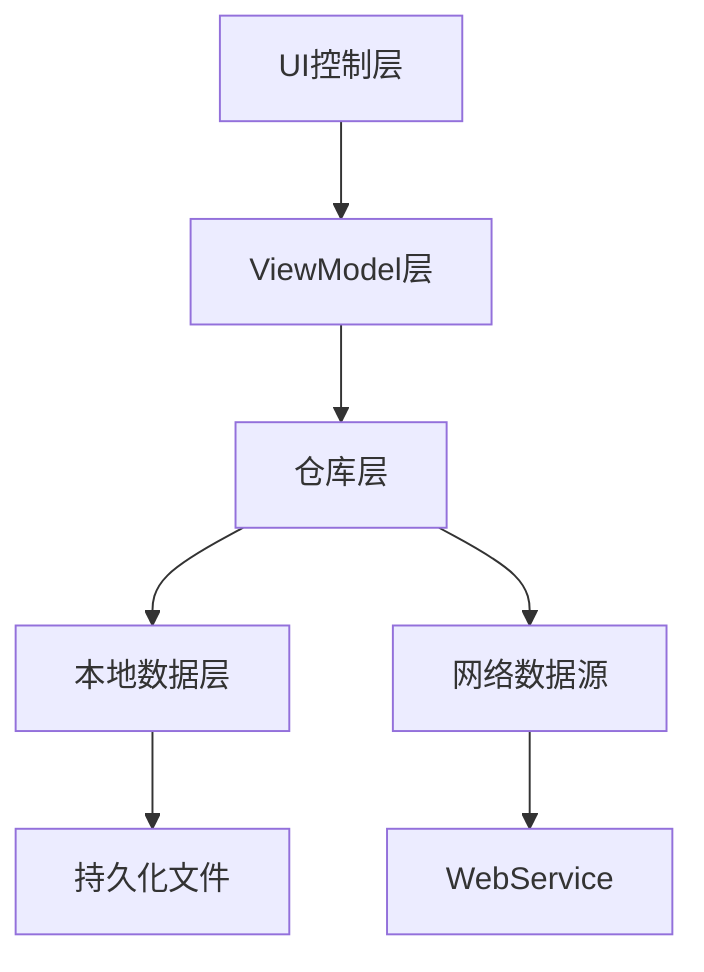

# SunnyWeather

**MVVM项目架构示意图**

```mermaid
graph TD
UI控制层-->ViewModel层
ViewModel层-->仓库层
仓库层-->本地数据层
本地数据层-->持久化文件
仓库层-->网络数据源
网络数据源-->WebService
```

**目录说明**

- logic 存放业务逻辑代码
  - dao 存放数据访问对象
  - model 对象模式
  - network 网络相关代码
- ui 存放界面展示代码
  - place 位置界面
  - weather 天气界面

